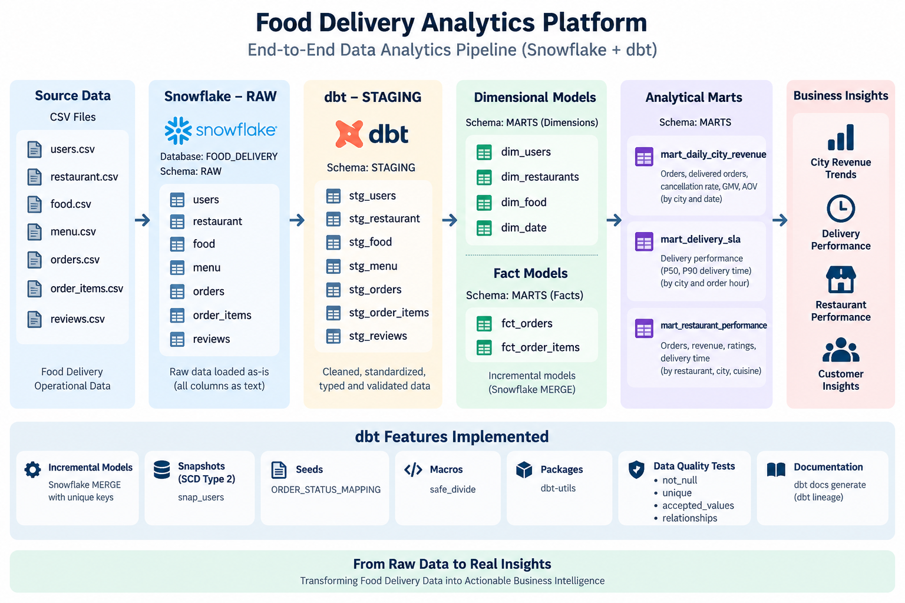

# Food Delivery Analytics Platform — Snowflake + dbt

An end-to-end food delivery analytics project built using **Snowflake and dbt**.

The project transforms raw food delivery data into analytics-ready dimensional models and business-focused marts while demonstrating practical dbt engineering patterns.

## Architecture
CSV Data >  Snowflake RAW > dbt STAGING > Dimensions + Facts > Business MARTS




## Snowflake Layers:
 ```text
    FOOD_DELIVERY
    ├── RAW
    ├── STAGING
    ├── SEEDS
    └── MARTS

## Technology Stack
- **Snowflake** — Data warehouse
- **dbt Core** — Transformation and data modeling
- **SQL / Jinja** — Transformations and dynamic logic
- **Snowflake CLI** — Data ingestion
- **dbt-utils** — Reusable utilities

## dbt Implementation
### Staging : Cleaned and standardized seven source datasets:
    users, restaurant, food, menu, orders, order_items, reviews

## Dimensions & Facts
### Dimensions
- dim_users
- dim_restaurants
- dim_food
- dim_date

### Facts
- fct_orders
- fct_order_items

### Analytical Marts
- Daily City Revenue — orders, delivered orders, cancellation rate, GMV and AOV
- Delivery SLA — delivery performance using P50 and P90 delivery times
- Restaurant Performance — orders, revenue, ratings and delivery performance

## dbt Features Demonstrated
- Incremental models with Snowflake MERGE
- SCD Type 2 snapshot
- dbt seeds
- Reusable macros
- dbt-utils package
- Data quality tests
- Documentation and lineage

## Data Quality
Implemented dbt tests including: not_null · unique · accepted_values · relationships


## Running the Project
### From the dbt project directory:
- dbt deps
- dbt seed
- dbt build

### Generate documentation:
- dbt docs generate
- dbt docs serve


## Project Status
V1 — Snowflake + dbt: Complete
Future versions may extend the project with AI/LLM-powered analytics and conversational querying.


## Reference

This project was developed independently, with the **Zomato AI Data Engineering End-to-End Project by Darshil Parmar** used as a reference for the overall project concept, dataset structure, and architecture.

- Reference project: [Zomato AI Data Engineering End-to-End Project] https://github.com/darshilparmar/zomato-ai-data-engineering-end-to-end-project/blob/main/README.md

- Source datasets: https://drive.google.com/drive/folders/1FEnGWMHhHzzTUCZOw1-YnH2v3DMuM-rs
